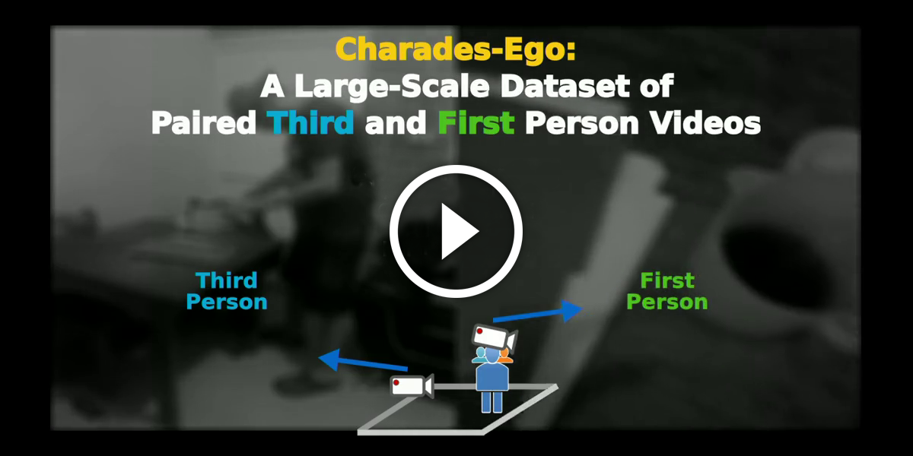

# Errata

**In the CVPR'18 paper, Table 3 uses version 0 of the CharadesEgo dataset for evaluation. Updated table for version 1 of the dataset will be added here.**


## ActorObserverNet code in PyTorch 

From: Actor and Observer: Joint Modeling of First and Third-Person Videos, CVPR 2018

Contributor: Gunnar Atli Sigurdsson

* This code implements a triplet network in PyTorch

The code implements found in:
```
@inproceedings{sigurdsson2018actor,
author = {Gunnar A. Sigurdsson and Abhinav Gupta and Cordelia Schmid and Ali Farhadi and Karteek Alahari},
title = {Actor and Observer: Joint Modeling of First and Third-Person Videos},
booktitle={The IEEE Conference on Computer Vision and Pattern Recognition (CVPR)},
year={2018},
code = {https://github.com/gsig/actor-observer},
}
```

## Dataset:

The Charades-Ego and Charades datasets are available at http://allenai.org/plato/charades/

[](https://www.youtube.com/watch?v=JkBFE2pzJkw&feature=youtu.be)

## Technical Overview:
 
All outputs are stored in the cache-dir. This includes epoch*.txt which is the classification output.
All output files can be scored with the official MATLAB evaluation script provided with the Charades / CharadesEgo datasets.

Requirements:
* Python 2.7
* PyTorch 


## Steps to train your own model on CharadesEgo:
 
1. Download the CharadesEgo Annotations (allenai.org/plato/charades/)
2. Download the CharadesEgo RGB frames (allenai.org/plato/charades/)
3. Duplicate and edit one of the experiment files under exp/ with appropriate parameters. For additional parameters, see opts.py
4. Run an experiment by calling python exp/rgbnet.py where rgbnet.py is your experiment file
5. The checkpoints/logfiles/outputs are stored in your specified cache directory. 
6. Build of the code, cite our papers, and say hi to us at CVPR.

Good luck!


## Pretrained networks:


Charades submission files are available for multiple baselines at https://github.com/gsig/temporal-fields
